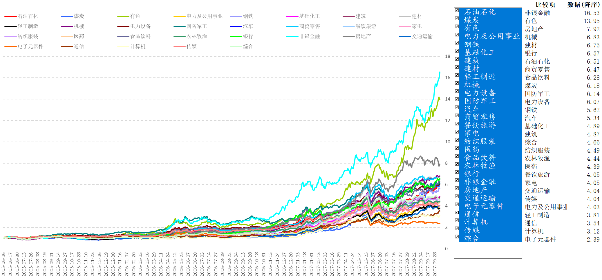
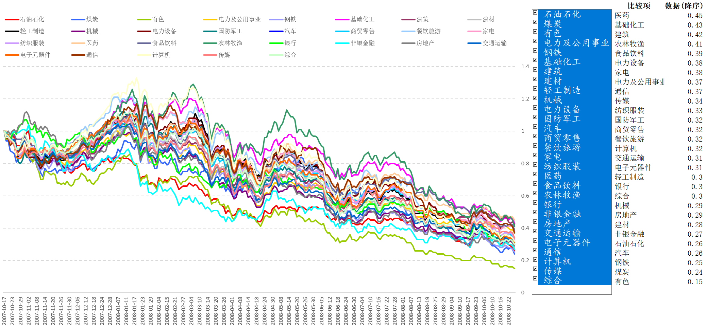
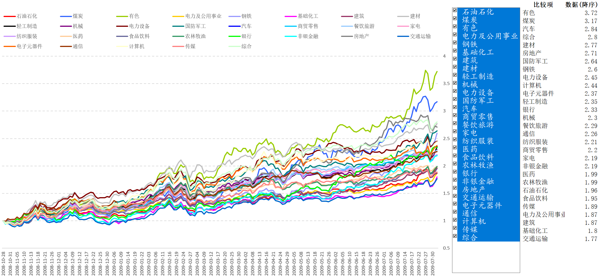
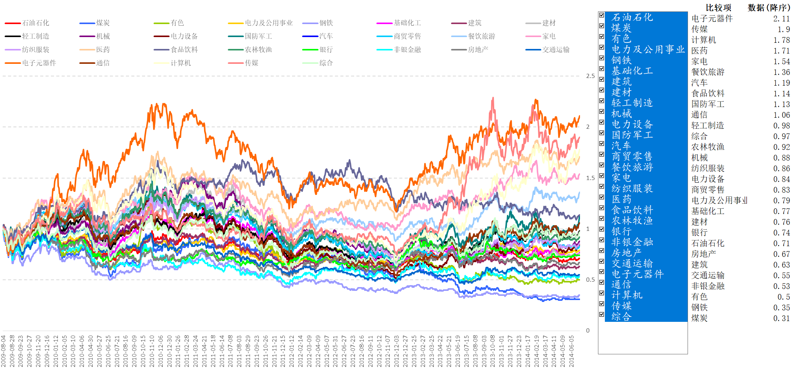
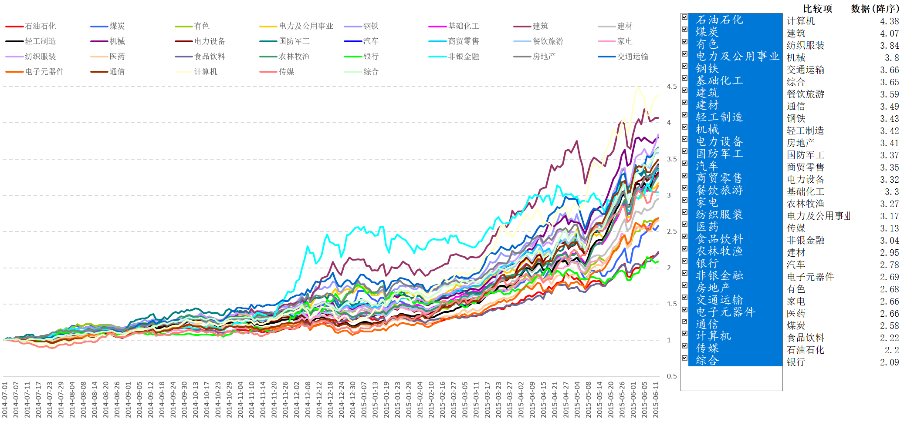
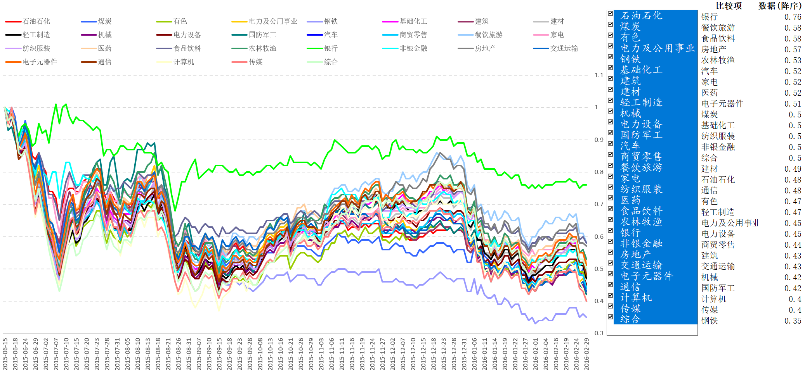
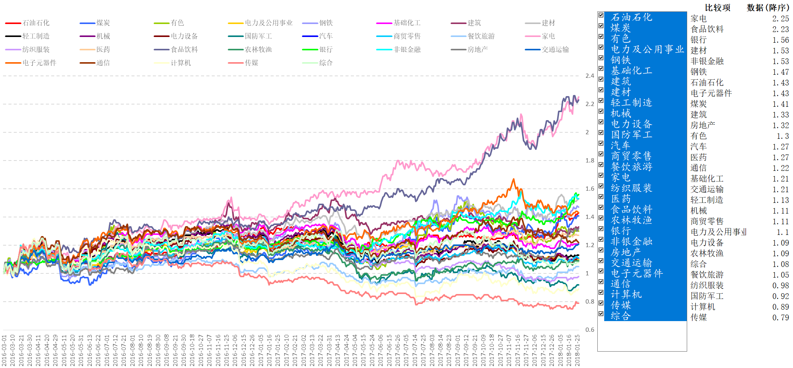

## 分板块轮动概览（中信一级行业分类）
| 趋势 | 时间                         | 前三板块                                   | 后三板块                                   | 备注                     |
| ---- | ---------------------------- | ------------------------------------------ | ------------------------------------------ | ------------------------ |
| 长牛 | 2005.6.6-2007.10.16 | 非银金融(16.53)、有色(13.95)、房地产(7.92) | 电子元器件(2.39)、计算机(3.12)、通信(3.54) | 投资与出口双轮驱动       |
| 快熊 | 2007.10.17-2008.10.27 | 医药(0.45)基础化工(0.43)、建筑(0.42)       | 有色(0.15)、煤炭(0.24)、钢铁(0.25)         | 次贷危机引发全球金融危机 |
| 短牛 | 2008.10.28-2009.8.3          | 有色(3.72)、煤炭(3.17)、汽车(2.84)       | 交运(1.77)、基础化工(1.8)、建筑(1.87)      | 四万亿投资驱动           |
| 长熊 | 2009.8.4-2014.6.30           | 电子元器件(2.11)传媒(1.9)、计算机(1.78)    | 煤炭(0.31)、钢铁(0.35)、有色(0.5)     | 出口与投资下滑           |
| 短牛 | 2014.7.1-2015.6.12           | 计算机(4.38)、建筑(4.07)、纺织服装(3.84)   | 银行(2.09)、石油石化(2.2)、食品饮料(2.22)  | 货币宽松创业板杠杆牛市   |
| 快熊 | 2015.6.15-2016.2.29          | 银行(0.76)、食品饮料(0.58)、餐饮旅游(0.58) | 钢铁(0.35)、传媒(0.4)、计算机(0.4)      | 泡沫破灭                 |
| 慢牛 | 2016.3.1-2018.1.26           | 家电(2.25)、食品饮料(2.23)、银行(1.56)     | 传媒(0.79)、计算机(0.89)、国防军工(0.92)   | 风格转换                 |

## 附：分阶段板块走势图（净值）

### 2005.6.6-2007.10.16

### 2007.10.17-2008.10.27

### 2008.10.28-2009.8.3

### 2009.8.4-2014.6.30

### 2014.7.1-2015.6.12

### 2015.6.15-2016.2.29

### 2016.3.1-2018.1.26

